::: callout-note
**Working paper — v0.9 (draft).** This is a *living* document, updated as the platform develops; cite the
version and date. The platform's living technical documentation (application, data pipeline, methodology
guide) is a companion to this paper. Citations and the reference list are managed in BibTeX
(Chicago author–date). Figures are screenshots of the running application, placed beside the methods
they illustrate.
:::

# Introduction {#sec-intro}

Communities decide where to site services, how to target investment, and whether a neighborhood's
conditions are improving on the basis of data measured at small geographic scales. A
generation of "community indicator" and "neighborhood indicator" systems has grown up to meet this need,
often stewarded by local *data intermediaries* that translate public data into accessible, place-based
information [@sawicki_flynn1996; @kingsley2014].

Yet the tools that deliver these data to the public share recurring limitations. Most present point estimates with
no indication of their statistical uncertainty, even though small-area survey estimates, especially
from the American Community Survey (ACS), can carry margins of error large enough to reverse apparent
rankings or trends [@spielman2014; @folch2016]. Their methodological choices are rarely documented:
how boundaries that change between censuses are reconciled, how rates are aggregated, how "change over
time" is computed from overlapping survey vintages, how clusters are judged "significant." Without that
documentation, the numbers cannot be audited. And because the data-processing
code is seldom released, the work is difficult to reproduce or to adapt to another region.

This paper documents the Carolinas Regional Explorer (CRXP), which addresses these limitations.
CRXP is an open, reproducible platform for census-tract community indicators across the 14-county
Charlotte region. It has two parts joined by a documented interface: an *open-source web application*
for exploring indicators as maps, trends, and spatial analyses, and an *open data pipeline* that ingests
heterogeneous public sources, computes indicators with explicit uncertainty, and hands a versioned data
product to the application. We designed the platform around four commitments (*openness*,
*uncertainty-awareness*, *methodological transparency*, and *replicability*). This paper serves the last
two: it states the choices we made and grounds each in the relevant literature, so that others can check
them.

Our contributions are:

1. **A reference implementation** (application + pipeline + versioned data contract) for open, small-area
   community-indicator platforms, designed so that another metro can adopt it by changing configuration
   (@sec-adoption).
2. **Uncertainty carried end to end:** propagation of ACS margins of error, coefficient-of-variation
   reliability flags surfaced in the interface, significance-tested change between non-overlapping
   periods, and published county estimates with their own MOE, pooled to the region, in place of tract
   averages (@sec-moe, @sec-agg).
3. **Documented, literature-grounded methodology** for the hard steps: ACS 5-year comparability
   (@sec-comparability), fractional population-weighted 2010→2020 tract harmonization (@sec-harmonize),
   direct and model-based estimation (@sec-sae), exact raster-to-tract zonal statistics (@sec-raster), and
   FDR-controlled spatial-cluster detection (@sec-spatial).
4. **A detailed, reproducible method for attributing vernacular neighborhood names to tracts** from
   volunteered geographic information (@sec-neighborhoods).
5. **A config-driven, multi-source data engine** spanning survey, model-based, administrative, and satellite data, with a
   source-sustainability classification (@sec-sources).
6. **A replication pathway:** adoption recipe, licensing, and attribution model (@sec-adoption).

# Background and related work {#sec-related}

**Community indicators and data intermediaries.** Planners and public administrators have compiled
place-based social, economic, and environmental indicators to guide local action for decades
[@sawicki_flynn1996]. Since the 1990s, the National Neighborhood Indicators Partnership (NNIP) has
organized local *data intermediaries* (university institutes, civic nonprofits, and government offices)
that make neighborhood data public and build local capacity to use it [@kingsley2014]. These
organizations confront a common technical problem: turning fragmented public data into trustworthy,
small-area indicators that non-specialists can explore. The Charlotte-Mecklenburg Quality of Life
Explorer, a long-running product of this tradition, is the direct motivation for CRXP. It is itself open
source: its application and processed data are MIT-licensed, and its code has been adapted for High
Point, North Carolina. CRXP extends that model from a single county's neighborhood profile areas to
census tracts across a multi-county, two-state region, and adds a documented source-to-indicator
pipeline and user-facing statistical uncertainty.

**Contemporary small-area platforms.** Several widely used tools deliver small-area data to the
public, among them the City Health Dashboard, the Opportunity Atlas, and EJScreen. The EPA removed
EJScreen, its environmental-justice screening tool, from its website in February 2025;
community-maintained reconstructions keep it available [@edgi_ejscreen2025]. Each tool is useful within
its domain, but few combine these strengths in one platform, as @tbl-comparison details.

## How CRXP compares to existing platforms {#sec-comparison}

The table contrasts CRXP with representative small-area platforms on the dimensions most relevant to
transparency and replication. Entries describe each tool as publicly documented on its website and
repositories as of September 2026 [@qol_explorer; @cityhealthdashboard_tech; @chetty2018atlas]. The
entries are descriptive, not evaluative.

| Dimension | **CRXP** | Charlotte QoL Explorer | City Health Dashboard | Opportunity Atlas | EPA EJScreen (archived) |
|---|---|---|---|---|---|
| Publish grain | Census tract | Neighborhood profile area (462) | City & tract | Census tract | Block group / tract |
| Coverage | 14-county, two-state region | Mecklenburg Co. | 970+ U.S. cities | National | National |
| Open-source **application** | Yes (MIT) | Yes (MIT) | No | No | No; removed from EPA site 2025, community rebuilds |
| Documented source-to-indicator **pipeline** | Yes (open code) | Processed data public; processing not published | Methods published | Methods published | Data + methods published |
| Margins of error shown to users | Yes (band + flag + hatch) | No | Yes (tract CIs in tables) | SEs in data; UI warnings | Percentiles, not MOE |
| Multi-source (survey + model + admin + satellite) | Yes | ACS + local administrative | Multi-source (health) | Linked tax/census records | Environmental + ACS |
| Time series + comparable-period change | Yes (5/10-yr, sig-tested) | Yes (trends) | Limited | Static cohorts | Limited |
| Interactive spatial analysis (LISA, bivariate) | Yes (FDR-LISA + correlation scatter) | Limited | Limited | No | Mapping only |
| Plain-language, cited indicator briefs | Yes (per indicator) | Partial | Partial | Limited | Limited |
| Open data download | Yes (CSV / JSON / zip) | Yes (CSV on GitHub) | Yes | Yes | Yes (archived) |
| Adapted or adaptable to another region | Yes (config-driven) | Yes (forked for High Point, NC) | National service | National service | National service |
| Proprietary GIS required | No | No | n/a | n/a | n/a |

: Comparison of CRXP with representative small-area data platforms. {#tbl-comparison}

Incumbent platforms excel on coverage or in a specific domain, and the local
precedent already shows that an open application can travel between regions. What none of them combines
is an open application, an open source-to-indicator pipeline, and user-facing uncertainty. CRXP is built
to fill that gap.

# Design goals and principles {#sec-design}

Six design principles put those commitments into practice. Each answers a limitation named in @sec-intro.

1. **Tract as the publish grain, with a regular update cadence.** The census tract is the finest scale at
   which most public indicators are reliably available; every CRXP indicator is published at the tract
   level. The catalog targets at least a biennial update cadence, and the source registry (@sec-sources)
   flags series that fall behind it; several do today (four NLCD land-cover measures end in 2021, LODES
   in 2022).
2. **Open and reproducible.** Both the application and the pipeline are open source and use no proprietary
   GIS, so partner organizations and students can run, audit, and extend the system. This applies
   the FAIR principles for the data products [@wilkinson2016] and the norms of reproducible
   computational research [@peng2011].
3. **Uncertainty-first.** Because small-area estimates are uncertain, the platform carries and displays
   that uncertainty [@spielman2014; @maceachren2012].
4. **Separation of concerns via a versioned data contract.** A data *engine* produces a documented,
   schema-versioned data product that an *application* consumes. That interface makes the application
   portable and the data reusable by other tools.
5. **Staggered updates and extensibility by configuration.** Sources update on different schedules and
   cover different geographies; the engine treats partial updates as normal and adds indicators through
   configuration.
6. **Accessible to non-experts.** Beyond the analyst-facing map, the platform offers plain-language,
   cited briefs and one-click data downloads, so residents and journalists can understand and reuse the
   data.

# System architecture {#sec-architecture}

CRXP is two components joined by a stable interface (@fig-arch). The *data engine* ingests public
sources, harmonizes geography, computes indicators with uncertainty, derives spatial analytics, and
writes both a curated *warehouse* and the *data contract* the application reads. The *application*
is a static, prerendered web client that loads the contract and renders interactive maps, trends, and
analyses entirely in the browser.

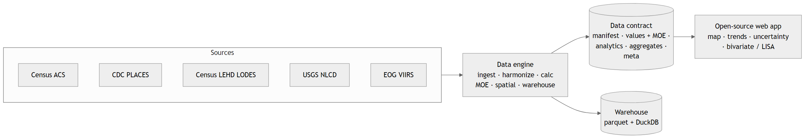{#fig-arch width=95%}

**Technology choices and rationale.** The application is a static site (prerendered HTML with a vector
map library) that requires no server or database at run time. Hosting is cheap, there is no scaling
work, and there is no server to secure or patch, which matters for civic projects with small budgets.
The lone exception is address search, which calls a single stateless
serverless function to proxy a geocoder (keeping the geocoding key server-side); the browser-side "use my
location" lookup needs no server at all, resolving a coordinate to its tract by point-in-polygon against
the loaded tract geometry.

Geometry carries only identifiers, and indicator values are joined to it
in the browser via the map library's *feature-state*, keeping payloads small and letting the app switch
indicators and years without reloading maps. The pipeline is written in Python to draw on its
data-science ecosystem; the warehouse uses columnar parquet files plus an embedded analytical
database (DuckDB), giving any downstream tool, including other applications, SQL access to the same
curated data without standing up a server.

# Data pipeline and methodology {#sec-methods}

Each subsection follows one pattern: it states the choice, gives the formalism with a
plain-language explanation, justifies it against the literature, and, where the choice surfaces in the
interface, illustrates it with the running application. The full indicator catalog, data dictionary, and
an equation reference are maintained in the companion living documentation (the Methodology Guide and Data Pipeline Technical Documentation).

## Region and geography {#sec-geo}

The study region is the 14-county Charlotte metropolitan region: 11 counties in North Carolina (Anson,
Cabarrus, Catawba, Cleveland, Gaston, Iredell, Lincoln, Mecklenburg, Rowan, Stanly, Union) and 3 in South
Carolina (Chester, Lancaster, York), comprising 752 census tracts on 2020 boundaries. The census
tract is the publish grain because it is the finest geography at which the ACS publishes the full table
set and at which most administrative data can be reliably placed; tracts are designed to be relatively
homogeneous units of roughly 1,200–8,000 residents [@census_tracts2018], small enough to stand in for
neighborhoods and large enough for stable estimates. County values use each source's published
county estimate, and the region is pooled from counties instead of averaged from tracts (@sec-agg). The
region is a configuration value (a list of county FIPS codes) so the same engine serves any set of
counties without code changes; this is what lets the platform move to another region (@sec-adoption).

## Sources and a sustainability-aware catalog {#sec-sources}

CRXP currently publishes 68 indicators drawn from five public sources and spanning eight of its ten
themes (Safety and Arts & Culture remain to be populated). The U.S. Census Bureau's American Community
Survey (ACS) 5-Year Estimates supply 42 indicators: demographic, economic, educational, housing,
transportation, insurance, and disability measures, plus a residential-stability measure for the
Engagement theme. CDC PLACES supplies 16 model-based adult-health measures, including a recently added
set of health-related social needs (food and housing insecurity, transportation barriers, social support,
and loneliness). The Census Bureau's LEHD Origin-Destination Employment Statistics (LODES) supply 3
Economy measures from the Workplace Area Characteristics file: total jobs, job density, and a
jobs–housing balance of workplace jobs per ACS household [@census_lodes]. The remaining seven are
Environment measures from the USGS National Land Cover Database (NLCD), including Tree Canopy Cover, and
EOG VIIRS Nighttime Lights (light pollution), for a total of 42 + 16 + 3 + 7 = 68.

LODES reports jobs on 2020 census blocks, which nest exactly within 2020 tracts, so tract values are
simple sums with no crosswalk. Because LODES is a synthetic, noise-infused full count rather than a
sample, it carries no sampling MOE and, like the raster measures, is shown without an error band. The
jobs–housing ratio's denominator, ACS households, does carry an MOE; the platform does not yet propagate
it. One ingester module per
source sits behind a common interface, so adding a source (as LODES showed) or many measures from an
existing source (as the PLACES expansion showed) is a localized, configuration-driven change.

**Bringing your own tract data.** Regions are not limited to these five sources. A generic
`tract_csv` source turns any file keyed by an 11-digit census-tract GEOID into an indicator with one
configuration file: the adopter names the GEOID and value columns, the data year, the kind of measure
(count, proportion, rate, median, or index), and the source credit. An optional 90% MOE column passes
through the same CV and reliability rules as the ACS. Files on 2010 tracts are allocated to 2020 tracts
with the platform's crosswalk: counts by allocation factor, and rates and proportions through
population-weighted pseudo-counts, which require a population column. Medians and indices have no
defensible allocation and must be supplied on 2020 tracts. The build stops if more than 5% of the file's
GEOIDs are not tracts of the declared vintage, since 2010 and 2020 tracts share most of their IDs and a
file on the wrong vintage would otherwise leave a third of the map blank while passing the coverage check.
Because the source publishes no county figure, county and regional values are derived from the tracts:
population-weighted for most kinds, and summed for counts, where a county total is published only if
every tract in the county has a value. The application labels these values as derived. The worked example in @sec-walkthrough follows one such
file from download to map.

A recurring failure mode for indicator systems that aggregate many feeds is *silent staleness*: a series
that quietly stops updating while still appearing current. We mitigate this with a machine-readable
*source registry* that records each source's provider, native geography, vintages, license, and update
cadence, together with a *sustainability classification*: *active* (refreshed on a known cadence),
*event-driven* (periodic, opportunistic), or *static / decommission-watch* (no longer updated). This
classification drives the per-indicator vintage label, so users can see how current each number is.

## A configuration-driven indicator model {#sec-model}

Each indicator is declared in a small configuration file specifying its source, the variables it draws
on, its *kind*, and presentation metadata. Supported kinds cover the common cases (`count`, `median`,
`proportion`, `rate`, and `density`), and numerators and denominators may be sums of several
variables. This matters because many community measures are *derived*: cost burden is the sum of several
income-share categories; a race/ethnicity grouping sums several base counts; child poverty has a
multi-line denominator. Expressing these in configuration keeps the engine small,
auditable, and analyst-editable, and it makes the precise definition of every indicator inspectable
without reading source code. Variable identifiers are the official ACS codes (e.g. `B19013_001E` for an
estimate and `B19013_001M` for its margin), and ACS subject tables are routed automatically to the
appropriate API endpoint.

## Margins of error and reliability {#sec-moe}

ACS estimates are sample-based and published with a 90% margin of error (MOE). Treating these point
estimates as exact is a well-documented hazard at the tract level, where MOEs are frequently large
relative to the estimate and can reverse apparent rankings or trends [@spielman2014; @folch2016]. CRXP therefore carries the MOE through every derived quantity and converts it to interpretable
reliability information shown in the interface (@fig-uncertainty).

We first convert the MOE to a standard error and a coefficient of variation:
$$ SE = \frac{MOE}{1.645}, \qquad CV = \frac{SE}{|\hat{x}|}\times 100\%, $$
where $\hat{x}$ is the estimate (the 1.645 factor is the 90% normal quantile the Census uses). *In plain
terms,* the standard error is the typical sampling "wobble" in the estimate, and the CV expresses that
wobble as a percentage of the estimate, a unit-free measure of reliability. We flag
estimates as *ok* ($CV \le 15\%$), *caution* ($15\% < CV \le 30\%$), or *unreliable* ($CV > 30\%$),
following long-standing Census practice and the National Research Council's guidance on using the ACS
[@citro_kalton2007; @census2020acs]. A known limitation is that the CV is unstable for
near-zero estimates, where a tiny absolute MOE can produce a huge CV; we report such values unsuppressed.

For derived measures we propagate the MOE using the Census Bureau's published formulas. For an
*aggregate* (a sum of estimates), MOEs combine in quadrature:
$$ MOE_{\text{sum}} = \sqrt{\textstyle\sum_i MOE_i^2}. $$
For a *proportion* $p = \hat{n}/\hat{d}$ whose numerator is a subset of the denominator,
$$ MOE_p = \frac{1}{\hat{d}}\sqrt{MOE_n^2 - p^2\,MOE_d^2}, $$
falling back to the ratio formula below when the radicand is negative (the documented Census behavior).
For a *ratio* $R = \hat{n}/\hat{d}$ whose numerator is *not* a subset of the denominator,
$$ MOE_R = \frac{1}{\hat{d}}\sqrt{MOE_n^2 + R^2\,MOE_d^2}. $$
*In plain terms,* when we combine estimates the uncertainties add up, but not linearly: independent
errors partly cancel, which is why they combine through squares and square roots. These propagation rules are implemented as pure functions and unit-tested against the worked
examples in the Census handbook.

Finally, to compare two estimates we use the Census difference test: the difference is statistically
significant at 90% confidence when
$$ \frac{|\hat{x}_1 - \hat{x}_2|}{\sqrt{SE_1^2 + SE_2^2}} > 1.645 . $$
This guards against reading noise as change (@sec-comparability). The interface puts all of this at the
point of use: a selected tract's trend shows a shaded ±MOE band, a reliability badge, and the
significance-flagged change (@fig-uncertainty).

{#fig-uncertainty width=95%}

CDC PLACES estimates are model-based and published with a 95% confidence interval rather than a 90% MOE;
we convert the CI half-width to a 90%-equivalent MOE so reliability is comparable across sources, while
flagging such indicators *model-based* in the interface because a model-based interval and a sampling MOE
are different kinds of uncertainty.

### Temporal comparability of model-based estimates

Uncertainty also limits which trends a platform may show, and here the sources diverge sharply. The
PLACES health measures are assembled into a multi-year series by stitching six
releases (newest-release-wins, with pre-2024 rows harmonized onto 2020 tracts), but that series is
presented strictly as levels per year, never as change. CDC is explicit that "the current modeling
procedure does not support using the estimates to track changes at the local level over time"
[@cdcplaces_faq]. Sub-county estimates poststratify to a fixed population structure, and time is not a
model variable even at county level. Apparent movement is often an artifact of questionnaire changes (CDC
flags colorectal-screening prevalence specifically) or of pandemic-era 2020 BRFSS collection.
The platform therefore treats temporal comparability as a source-level property carried in the data
contract: a `crossReleaseTrend` flag marks every PLACES indicator, and each interface that would
otherwise assert change (the significance-tested change markers, the printable report's *change* column,
and the county-profile deltas) is suppressed for those indicators, while the level series and its
uncertainty band remain. This is the same uncertainty-first principle applied one level up: a
platform that propagates margins of error should also refuse to manufacture a trend its source cannot
support. For survey-based ACS indicators, by contrast, change *is* meaningful when read correctly, which
the next section addresses.

## ACS comparability over time {#sec-comparability}

ACS 5-year estimates *overlap*: the 2020–2024 and 2019–2023 estimates share four years of sample, so
adjacent vintages are not statistically independent and their difference is not a valid measure of change
[@citro_kalton2007; @census2020acs]. CRXP therefore treats the annual series as a
rolling 5-year estimate and computes change and significance only between non-overlapping periods.
For a selected tract the application reports two changes: a 5-year (latest minus five) and a
10-year (latest minus ten), each evaluated with the difference test in @sec-moe. These endpoints are
derived from the latest available year, so they advance automatically as new data is released (adding a
2025 vintage shifts the comparisons to 2020→2025 and 2015→2025 with no code change). The trend chart's
x-axis is drawn proportional to the actual year, so uneven cadence (biennial NLCD releases, periodic VIIRS)
and gaps appear at their true spacing.

## Harmonizing 2010 and 2020 tract boundaries {#sec-harmonize}

Census tract boundaries are redrawn each decade; ACS vintages through 2019 use 2010 tracts, and 2020
onward use 2020 tracts. In this region, the 611 tracts of 2010 became 752 tracts in 2020, and 135 of the
2010 tracts were split or redrawn (fewer than 99% of their residents fall in a single 2020 tract). Comparing a 2017 value to a 2024 value therefore means comparing two different geographies. To
place the series on a single 2020 geography we *harmonize* the earlier years by areal interpolation
[@goodchild_lam1980], weighting by population rather than land area.

Using the Census 2010↔2020 *block* relationship files, each 2020 block's population is apportioned
across the 2010 tracts it overlaps in proportion to the overlap land area (a dasymetric refinement that
splits a straddling block rather than assigning it whole to one side); those apportioned block
populations are then summed to form the allocation factor from a 2010 tract to a 2020 tract:
$$ afact(t_{10}\!\to\! t_{20}) = \frac{\text{2020 block population apportioned to } (t_{10}\cap t_{20})}{\text{2020 block population apportioned to } t_{10}} . $$
Allocation is applied to the *raw variables before indicators are computed*: counts are summed,
$count_{20} = \sum_{t_{10}} count_{10}\cdot afact$; MOEs combine as
$MOE_{20} = \sqrt{\sum (afact\cdot MOE_{10})^2}$ (an independence approximation); medians, averages, and
indices are population-weighted averages of the contributing tracts' values.

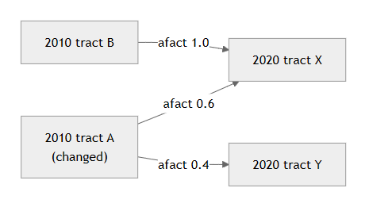{#fig-harmonize width=70%}

*Why population, not area.* Area weighting assumes people are spread uniformly within a tract, which badly
misallocates tracts that split into pieces of widely different density. In this region, a small-but-dense
2020 tract that holds roughly a fifth of an old tract's population receives only ~0.4% of it under area
weighting but its true ~21% under population weighting.^[2010 tract 37007920300 in Anson County: its
2020 successor tract 37007980000 covers 0.45% of the old tract's land area but holds 20.9% of its
population.] Population-based interpolation is the standard for
count-type variables and underlies established tract-harmonization products [@logan2014; @manson2023];
dasymetric refinements with ancillary data extend it [@mennis2003; @eicher_brewer2001]. This harmonization raised the coverage of valid comparable-period change from
roughly 480 to about 749 of 752 tracts. Medians remain approximate: they are population-weighted
averages of tract medians, which is exact only when within-tract distributions are
similar; the unbiased fix (reconstructing medians from afact-weighted binned distributions) is planned.

## County and regional estimates {#sec-agg}

A county or regional value is a different estimand from a tract value, and averaging tract values to obtain
it is biased; for medians and indices it is statistically invalid. The unweighted mean of tract rates
over-weights small tracts [the *ecological* and *modifiable areal unit* problems; @robinson1950; @openshaw1984]; a county's median income or Gini coefficient cannot be recovered by averaging its tracts' medians at
all. CRXP therefore does not aggregate tracts for county metrics. Instead it uses the county-level
estimate published by each source, and pools the region explicitly.

**County.** Because county boundaries are stable across the 2010 and 2020 censuses (no harmonization
needed), the engine fetches each county's published estimate directly (ACS county tables carrying their
own, smaller county margin of error; the CDC PLACES county model; or county zonal statistics for the
satellite measures) and runs them through the *same* indicator calculator used for tracts. Each county
thus gets its published value and MOE for every kind, including the medians and indices that averaging
tracts would get wrong.

**Region.** The 14-county region has no single published estimate, so it is pooled by indicator kind:
counts are summed; rates use the pooled numerator over the pooled denominator,
$$ p_{\text{region}} = \frac{\sum_c \text{num}_c}{\sum_c \text{den}_c}, $$
(the exact pooled rate, with its Census proportion/ratio MOE on the summed components); and medians and
indices use a population-weighted mean of the county values. That is an approximation: an exact
regional median would require microdata. County and regional series, with propagated MOE
(`countyMoe`/`regionMoe`), are precomputed into a `county_indicators` table and exported in the contract,
so the interface labels these lines plainly as *County* and *Region*. (The one place a simple
unweighted mean remains is the *ad-hoc average of a user-selected set of tracts* in a custom report, which
is a selection summary, not a published geography.)

## Direct and model-based estimates {#sec-sae}

Most CRXP indicators are *direct* estimates published by the ACS at the tract level, the simplest and
most defensible kind. Where a measure is modeled rather than tabulated, we use *model-based
small-area estimates*: the CDC PLACES health measures are produced by multilevel regression and
poststratification (MRP) on survey data, a now-standard approach for small-area prevalence [@gelman_little1997; @cdcplaces_methodology]. For cross-tabulations the ACS does not publish at tract level, a
planned tier will fit small-area models to public-use microdata with design-based standard errors in the
Fay–Herriot tradition [@fay_herriot1979; @rao_molina2015]. A companion review compares the methods
available for that tier, from allocation-factor crosswalks to model-based estimation, when the microdata
geography (the PUMA) does not nest into counties [@venkitasubramanian2026_microdata]. Every indicator records its estimation
method in the warehouse and metadata, so users and reviewers can see *how* each number was produced
and treat direct, model-based, and (eventually) survey-modeled estimates with appropriate care.

## Raster-to-tract zonal statistics {#sec-raster}

Environment indicators are derived from 30-meter satellite rasters via area-weighted zonal statistics
computed with the *exact fraction* of each pixel falling inside a tract, rather than the cruder
pixel-centroid rule. This is the `exactextract` method [@baston_exactextract]. The centroid rule
misassigns partial pixels along tract edges, and irregular, mid-sized polygons like tracts have many edge
pixels. Land-cover *shares* (forest, cropland, wetlands, developed land) are
the coverage-weighted fraction of a tract's non-nodata area in the relevant NLCD classes; *continuous*
measures (impervious surface, tree-canopy cover, nighttime-light radiance) are coverage-weighted means
[NLCD: @homer2020; VIIRS: @elvidge2021]. The Annual NLCD product supplies land cover for most
years from 2001 onward, so these indicators carry a multi-year series, not only decadal snapshots.

Because these are wall-to-wall measurements, not samples, they carry *classification accuracy*
instead of a sampling MOE, and the application shows no error band or reliability flag for them, because
the uncertainty is of a different kind. Two caveats apply and are documented:
satellite land-cover products have published per-class accuracy that varies by class, and any tract-level
zonal statistic inherits the arbitrariness of the tract boundary itself [the modifiable areal unit problem; @openshaw1984].

## Spatial analytics: standardization, classification, and clusters {#sec-spatial}

For each indicator and year the engine computes three things consumed by the interface.

**Standardization.** Per indicator-year, values are converted to z-scores (mean 0, sd 1 across tracts),
which the bivariate scatter and cluster analysis build on.

**Classification.** The choropleth uses quantile class breaks computed once over the pooled
multi-year distribution and held constant across years, so a given color means the same value range in
every year and change over time can be read off the map. Choosing and fixing a classification is a
consequential cartographic decision [@slocum2009; @brewer2016]; fixing it across time is what
keeps the animated year slider from misleading.

**Clusters and outliers.** Neighborhood data are spatially structured: "everything is related to
everything else, but near things are more related" [@tobler1970]. We detect that structure with Local
Indicators of Spatial Association [Local Moran's I; @anselin1995], which classify each tract as part of a
High–High or Low–Low *cluster*, a High–Low or Low–High *spatial outlier*, or *not significant*
(@fig-lisa). Significance is a conditional-permutation pseudo p-value: tract *i*'s value is held fixed
while its hypothetical neighbors are drawn *without replacement* from the *other* tracts' scores (9,999
permutations). This is the correct reference distribution for the conditional test, and a correction
over a naïve with-replacement draw. Because 752 tracts are tested simultaneously, the pseudo p-values are
then Benjamini–Hochberg false-discovery-rate controlled [@benjamini_hochberg1995] before a tract is called significant; without this correction, dozens of tracts would light up by
chance alone.

Two further choices make the corrected test usable in practice. First, the test runs on *rank-based
inverse-normal scores*, $\Phi^{-1}\!\big(r_i/(n+1)\big)$ for a tract of rank $r_i$ among $n$, rather than
on raw values [@beasley2009]. Many community indicators are strongly right-skewed: a few tracts sit seven
to nine standard deviations above the regional mean, and because every permutation can draw them, they
widen the null distribution until ordinary clusters cannot beat it. For poverty rate in 2024, which has a
clear global spatial autocorrelation (Moran's $I \approx 0.31$), 229 tracts have an unadjusted
$p < 0.05$ but only 7 remain significant after FDR correction on raw values; on rank-normal scores, 153 do. *In plain
terms,* the test asks whether a tract and its neighbors rank unusually high (or low) *together* in the
region, so a handful of extreme tracts cannot mask real clusters; High and Low therefore refer to rank
position.

Second, the permutation count sets the smallest attainable p-value, $1/(P+1)$. The BH procedure
over $m$ tests rejects nothing until some p-value falls below $\alpha/m$, which is about $6.6\times10^{-5}$
here; with $P = 999$ (floor 0.001) at least 15 tracts had to share the floor before any was called
significant, and several strongly clustered indicators showed no clusters at all. With $P = 9{,}999$ the
floor is $10^{-4}$, and two tracts at the floor suffice. The rank transform has a cost: a High–High
cluster says that a group of tracts ranks high together, not that their values are far above the
regional mean, so in an indicator with a narrow range a significant cluster can be substantively small.
Results are also not comparable with a raw-value LISA run in standard packages.

Spatial weights are k-nearest-neighbor (k = 8), row-standardized, built from each tract's
*representative point* (a point guaranteed to lie inside the polygon). A bounding-box midpoint, by
contrast, can fall outside an L-shaped or coastal tract and distort the neighbor graph. LISA and z-scores
are computed once in the pipeline (the single statistical source of truth) and consumed by the app as
precomputed values. Clusters are computed for census tracts only; the county view offered for the
choropleth is not available in cluster mode.

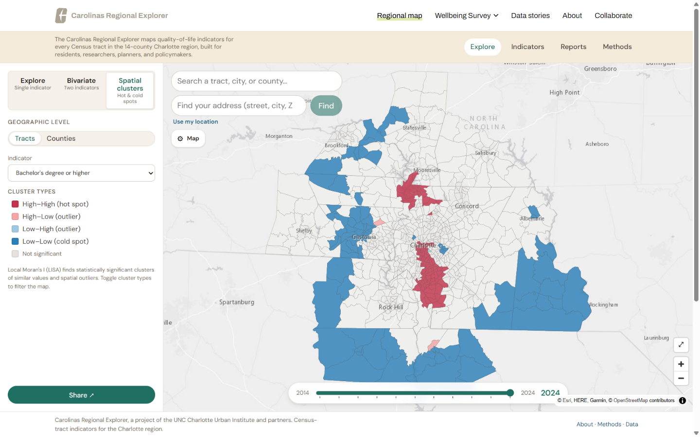{#fig-lisa width=95%}

## Bivariate analysis {#sec-bivariate}

To examine how two conditions co-occur, such as poverty and educational attainment, the application
crosses two indicators on a 3×3 bivariate choropleth: each indicator is split into rank terciles
and the nine combinations are given a two-dimensional color scheme, a technique with a long cartographic
pedigree [@olson1981; @brewer2016]. Hovering a grid cell highlights the matching tracts. Like the cluster
map, the bivariate view is available for census tracts only.

Beside the map, a correlation scatter plots the two indicators' standardized values, one dot per
tract colored by its bivariate class, with marginal distributions, a least-squares regression line, and
both Pearson and Spearman correlations (@fig-scatter). Spearman (rank) is shown alongside Pearson
because most indicators are skewed and the choropleth already colors by rank. Both are
presented as descriptive only: tract observations are spatially autocorrelated, so the *effective*
sample size is far below the tract count and a naïve significance test would be badly anti-conservative
[@clifford1989]. The scatter therefore reports no p-value, and two-way hover links
each dot to its tract on the map and names the neighborhood (@sec-neighborhoods).

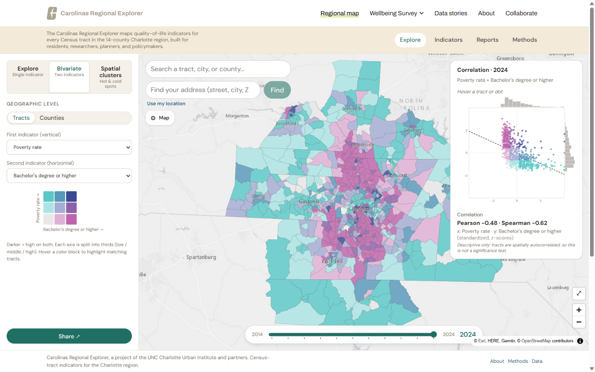{#fig-scatter width=95%}

## Attributing vernacular neighborhood names to tracts {#sec-neighborhoods}

Residents think in *neighborhoods*, not tract numbers, but neighborhoods are *vernacular regions* with
no official boundaries; their extents are fuzzy, overlapping, and contested [@montello2003].
To help users orient themselves, CRXP attaches one or more approximate neighborhood names to each tract,
labeled as for orientation only. The method has four steps, each reproducible.

**1. Acquire named points (volunteered geographic information).** We query the OpenStreetMap (OSM)
Overpass API for `place = neighbourhood | suburb | quarter` point features within the region's
bounding box. OSM is a mature source of volunteered geographic information whose place data are broadly
fit for orientation, with the usual caveat of uneven contributor coverage [@goodchild2007; @haklay2010].
Results are cached so builds are deterministic and offline-repeatable.

**2. Region-filter and de-duplicate.** Each point is tested against the 14 county polygons
(point-in-polygon); points outside the region are dropped, and duplicates are removed by `(name, county)`
so the same name in two counties is kept distinct. This yields the committed `neighborhoods.json`.

**3. Attribute tracts by Voronoi area-weighting.** Each tract is assigned a *share* of each nearby
neighborhood by approximating its overlap with the Voronoi (Thiessen) tessellation of the
neighborhood points [@okabe2000], the partition of space into "the area closest to each
named point." Concretely, we lay a deterministic grid over the tract's bounding box, keep the interior
sample points (point-in-polygon), and assign each sample to its nearest neighborhood point; the fraction
of a tract's interior samples nearest to a given neighborhood is that neighborhood's *area share* of
the tract. The result is a ranked list of neighborhoods with shares for each tract, since a tract often
spans more than one named area.

**4. Threshold, rank, and fall back.** We keep neighborhoods whose share is at least 15%, up to three per
tract, ranked by share. To avoid attaching a far-away name to a tract in a sparsely-mapped rural area, we
compute the great-circle (haversine) distance from the tract's centroid to its nearest neighborhood point
and apply an 8 km distance cap: beyond it, or when no neighborhood clears the share threshold, the
tract falls back to its city/place name (point-in-polygon against municipal boundaries) and then its
county. The display label is "*Name* area" for a single neighborhood or "*A / B*" for several. About
four in five tracts (599 of 752) receive a neighborhood label; the rest fall back to a city or town (30)
or their county (123). The
parameters (grid resolution, 15% share floor, three-name cap, 8 km cap) are configuration values, and the
whole step is pure and unit-tested.

A region that keeps its own neighborhood points (a planning department's list, for example) can use
them instead of OSM: the same attribution runs on any GeoJSON file of named points
(`gen-neighborhoods.mjs --points <file> --name-field <field> --attribution "<credit>"`), and the credit
replaces the OSM notice on the Methods page and in the download bundle.

These names are approximate and for orientation only, and the interface says so; they are not
official boundaries, and OSM coverage varies. The attribution is dasymetric in spirit [@mennis2003]: it
distributes a fuzzy, point-based signal over areal units using an explicit distance-based rule, without
asserting precise borders.

## Warehouse and the versioned data contract {#sec-warehouse}

Computed indicators are stored in a long-format `tract_indicators` table (geoid, indicator, year, value,
MOE, CV, reliability, period window, rolling flag, estimation method, source vintage) as one parquet
file per indicator plus a DuckDB database that any tool can query with SQL.
The parquet files are committed to the repository so the contract can be rebuilt on a fresh clone without
re-fetching from upstream APIs.

On *handoff*, the engine emits the application data contract and merges it into the app: an indicator
manifest (carrying a `schemaVersion`), per-indicator value files (with MOE/CV/reliability), precomputed
spatial analytics (z and FDR-LISA), county/region aggregates (with propagated MOE), per-indicator
metadata, and a `provenance.json` recording the library and GDAL/PROJ versions that produced the data.
Manifest and aggregate updates are written atomically (temp file + rename) so an interrupted handoff
cannot leave a half-written contract. The contract is the only coupling between engine and application,
and its `schemaVersion` lets the app refuse data it does not understand.

## Quality assurance and testing {#sec-qa}

Quality control is layered. Ingestion is defensive: ACS requests retry with backoff, and a *partial*
failure (some counties returned, others did not) raises an error instead of silently publishing a
truncated year that would corrupt the series. Only a vintage that is absent for every county is
skipped. A build-time QA gate fails the build if a year's geographic coverage collapses, its
null rate is excessive, or finite values fall outside a configured plausible range. Each check also
leaves a record: a JSON report per indicator and a summary table in `warehouse/qa/` (@fig-qa-report),
written for failed checks as well as passing ones. `python -m crxp_data.qa --all` re-runs the gate over
the committed warehouse without fetching anything, and the reports ship with the public repository. The statistical core
(MOE propagation, the difference test, the harmonization allocation, representative-point centroids, and
the FDR procedure, verified to control false discoveries on spatially random data) is unit-tested
against worked examples. Finally, the application's contract validator checks the handed-off files
before every build: supported `schemaVersion`, value-years aligned to the manifest, numeric sanity (no
NaN), analytics content (LISA quadrants in range, years aligned), aggregate completeness, and geoid
reconciliation.

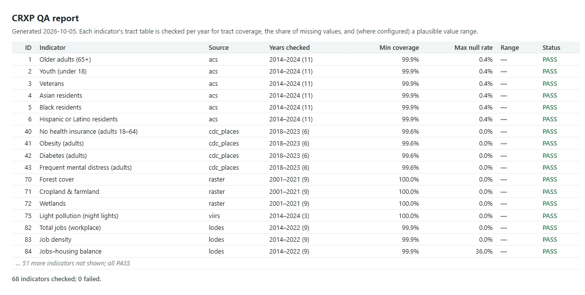{#fig-qa-report width=95%}

# The application {#sec-app}

The application turns the data contract into an explorable interface for several audiences at once: an
analyst's map, a resident's plain-language explainer, and an open-data portal. The public site embeds the
explorer inside a wider regional site (the map figures show that site's navigation), while profile,
report, and data pages are served directly by the application.

**Explorer.** The headline view is a choropleth explorer (@fig-explorer): an indicator mapped at
tract or county level with the cross-year-consistent class breaks of @sec-spatial, an interactive legend
that filters the map by class, a year slider, and the uncertainty and comparable-period machinery of
@sec-moe surfaced on selection. Indicators are organized by theme, alphabetical within each theme, and
a sub-heading separates *Character* (general demographics) from the *Quality-of-Life dimensions*;
indicator dropdowns are grouped into theme-colored sections so a long list is easy to scan.

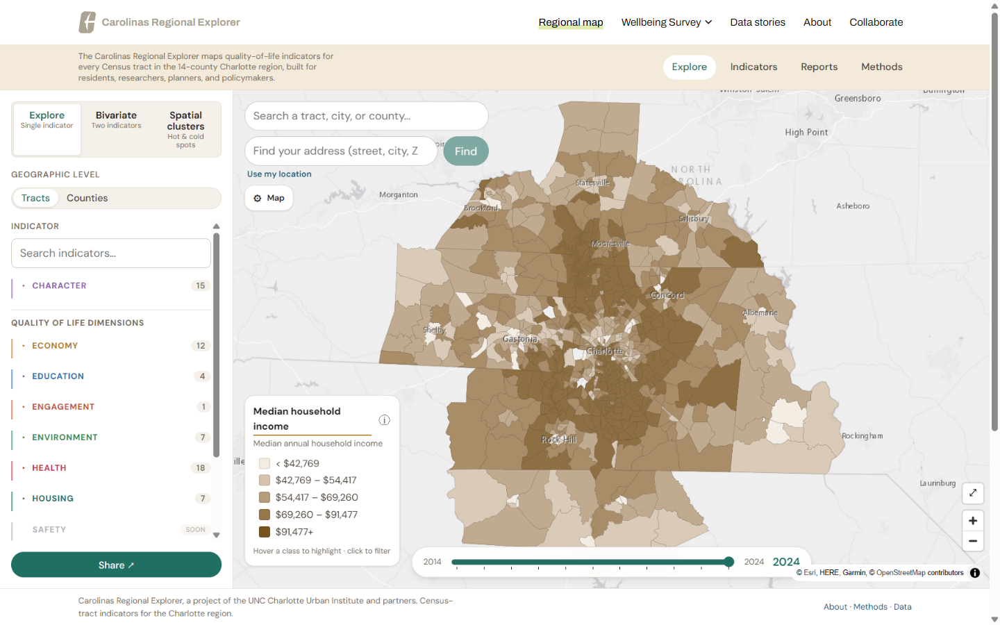{#fig-explorer width=95%}

**Plain-language, cited briefs.** Every indicator has a *"why this matters"* brief written for
residents and journalists, with a short list of verified "Learn more" resources and an "About the
data" provenance note. The explore sidebar shows a brief lead with a link to the full indicator page.
This serves the accessibility principle (@sec-design): the platform explains what each indicator
measures and why it matters.

**Profiles.** Each county has a profile page (@fig-county) with a real-polygon inset/locator map, a
14-county switcher, metric cards, social sharing, and a standard attribution footer; the
locator doubles as a switcher (each county is a link).

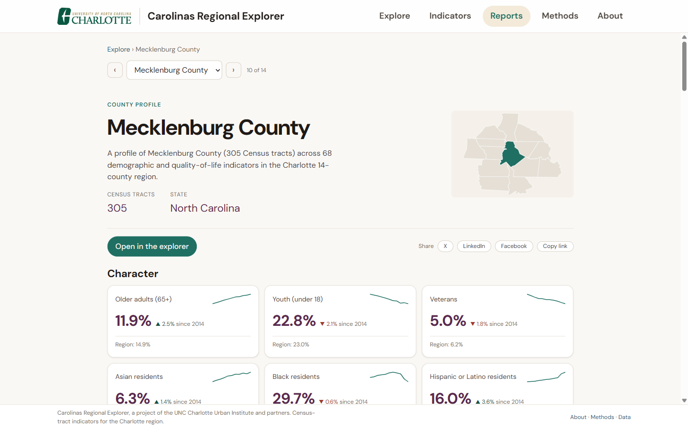{#fig-county width=95%}

**Reports and downloads.** A custom multi-tract report is printable and shareable on social media
(the selection is encoded in the URL), with the attribution footer for any printed or shared artifact. An
open-data page (@fig-data) exposes a per-dimension data dictionary with CSV and JSON downloads per
indicator and a one-click "Download all" archive; these files are rebuilt with every deploy, so they
match the live data.

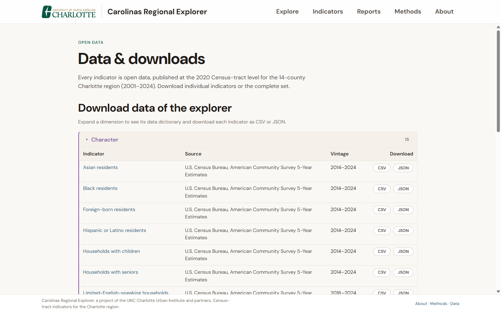{#fig-data width=95%}

Throughout, provenance badges (source vintage; *model-based* for CDC PLACES; *pre-2020 harmonized* for
ACS) keep the lineage of each number visible (@fig-uncertainty).

# Reproducibility and adoption {#sec-adoption}

## Replication recipe {#sec-recipe}

CRXP is designed so that another region can stand up its own explorer primarily by editing configuration.
The high-level recipe:

1. **Define the region.** Edit `config/region.yml`: list the counties (FIPS), set the tract vintage and
   CRS, and the ACS years. Comparable-period endpoints are derived automatically from the latest year.
2. **Install the engine.** Create a Python environment and install the pipeline's pinned dependencies.
3. **Provide source access where needed.** Most sources are public and fetched automatically (ACS via the
   Census API or Census Reporter; CDC PLACES via Socrata; LODES from the LEHD file server; NLCD via the MRLC web service). A few are
   account-gated or large and are dropped in locally (VIIRS night lights; NLCD Tree Canopy; the census
   block files for harmonization). Add a free Census API key for multi-vintage history.
4. **Select indicators.** Reuse the provided indicator definitions or add new ones as configuration
   (choosing a kind: count / median / proportion / rate / density). Bulk additions can be scripted. A
   local or third-party tract file enters through the generic `tract_csv` source (@sec-walkthrough).
5. **Build.** Run the pipeline per indicator; the QA gate and the printed summary (coverage,
   comparable-period change and significance, reliability mix) surface problems early.
6. **Hand off and deploy.** Re-run with handoff to merge the data contract into the application, validate
   it, build the static site, and deploy to any static host. Address search runs as a small serverless
   function (Netlify in our deployment). Pressing Enter resolves an address to its tract through the
   U.S. Census Bureau geocoder, which needs no key. Type-ahead suggestions use Geoapify: create a free
   account at geoapify.com, copy its API key, and set it as `GEOAPIFY_API_KEY` in the Netlify site's
   environment variables (or in a local `.env` file for `netlify dev`). Without the key, suggestions are
   off and Enter-to-search still works. Suggestions are limited to the region's bounding box, which the
   build regenerates from the county geometry.
7. **Document and attribute.** Update the living documentation; retain attribution per the licenses below.

See @sec-checklist for everything a new region edits.

## Region adoption checklist {#sec-checklist}

A new region starts from one file, `config/region.yml`. The excerpt below is the Charlotte file with
three of its fourteen counties shown.

```yaml
region:
  name: Charlotte 14-county region
  tract_vintage: 2020          # publish grain: 2020 Census tracts
  crs: EPSG:4326

counties:
  - { fips: '37119', name: Mecklenburg, state: NC }
  - { fips: '37025', name: Cabarrus, state: NC }
  - { fips: '45091', name: York, state: SC }
  # ...

acs:
  product: acs5
  provider: auto               # Census API if CENSUS_API_KEY is set, else Census Reporter
  annual_years: [2014, 2015, 2016, 2017, 2018, 2019, 2020, 2021, 2022, 2023, 2024]
  tract2010_years: [2014, 2015, 2016, 2017, 2018, 2019]

reliability:
  cv_caution: 15.0
  cv_unreliable: 30.0
  z_90: 1.645
```

`region`
:   The region's display name, the tract vintage published (2020), and the coordinate system.

`counties`
:   Every county by five-digit FIPS code. All tract filtering, county profiles, and regional pooling
    follow this list.

`acs`
:   The ACS product and the endpoint years to fetch. Years listed in `tract2010_years` use 2010 tract
    boundaries and are harmonized to 2020 tracts automatically; the comparable non-overlapping periods are
    derived from the latest year.

`reliability`
:   The coefficient-of-variation thresholds for the caution and unreliable flags, and the z-value of the
    published 90% margins of error.

@tbl-checklist lists what else a region touches. We found these items by searching both code bases
for assumptions specific to Charlotte; the items marked *automatic* need no action.

| What | Where | Automatic or manual |
|---|---|---|
| Counties, ACS years, reliability thresholds | `config/region.yml` | Manual (one file) |
| State codes for LODES downloads | `config/sources/lodes.yml` (`states`) | Manual |
| Indicator selection and new tract files | `config/indicators/*.yml` (@sec-walkthrough) | Manual (one file each) |
| Census API key (optional, for volume) | `CENSUS_API_KEY` environment variable | Manual |
| Tract and county geometry | `scripts/gen-fixture.mjs --src <dir>`, then `scripts/gen-geo.mjs` | Manual: these scripts were written for Charlotte's source files and must be adapted |
| City and town boundaries | `scripts/gen-geo.mjs --shp <dir>` | Manual: supply municipal boundary files; the NC and SC file names and county lists are specific to this region |
| Neighborhood names | `gen-neighborhoods.mjs` | Automatic (OSM), or `--points` with a local file |
| Map extent and initial view | Fitted to the tract geometry | Automatic |
| Address-search area | `netlify/region.mjs`, generated at build | Automatic |
| Address-search key | `GEOAPIFY_API_KEY` in the host's environment | Manual (optional) |
| Download bundle README (geography, sources) | Generated from the manifest | Automatic |
| Site text, branding, and logo | Home, About, Methods pages; header and footer | Manual |
| Regional context panel | `RegionContext.svelte` | Manual (rewrite or remove) |
| Plain-language indicator briefs | `indicatorBriefs.js` | Manual: local context and resources are Charlotte-specific |
| Default county for Reports | Site navigation (`/county/<fips>`) | Manual |
| Contact in the OpenStreetMap request header | `gen-neighborhoods.mjs` | Manual |

: Configuration and content a new region edits. Scripts are under `scripts/`; the briefs file is under `src/lib/content/`. {#tbl-checklist tbl-colwidths="[32,34,34]"}

Running the pipeline needs command-line Python and Node, comfort editing YAML, and a static web host.
No desktop GIS software is required.

## Licensing and attribution {#sec-license}

The code is released under the MIT License and this paper under Creative Commons Attribution 4.0
(CC BY 4.0); data retain their source licenses (ACS and LODES public domain; CDC PLACES public domain;
USGS/NLCD public; OpenStreetMap ODbL; EOG/VIIRS terms). The pipeline's reproducibility package is
published as an open repository [@crxp_data_public], and the application source is public as well [@crxp_app]. A `CITATION.cff` file gives the canonical citation;
an archived Zenodo release will add a DOI. Regional adaptations should credit the original work, as the
license requires. In the application, shareable and printable artifacts (profiles, reports) carry
a standard attribution footer.

## Living documentation {#sec-docs}

Three companion documents, an application technical reference, a data-pipeline reference, and a
methodology guide, are maintained alongside the code and are supplementary material to this paper.

# Discussion {#sec-discussion}

## Strengths {#sec-strengths}

CRXP is, to our knowledge, unusual in combining an open application *and* an open pipeline with
user-facing uncertainty. The combination matters more than any one part. Because a single versioned
contract feeds the map, the profiles, the reports, and the downloads, a number carries the same margin of
error, reliability flag, and vintage wherever a user meets it, and a correction to the pipeline reaches
every page at the next build.

## Limitations {#sec-limitations}

The platform has so far been validated in a single region, and broader adoption will test its
generality. Most of the engine transfers without change; what each region must supply is local (county
list, any parcel or local layers, and access to account-gated sources).

Two statistical approximations remain. County metrics are the published county estimates and regional
rates are exactly pooled, but the regional value of a *median or index* is a population-weighted
approximation (an exact regional median would require microdata). Medians under tract harmonization are
likewise approximated as a weighted average of tract medians; a binned-distribution reconstruction is
planned.

The data have limits too. Neighborhood attribution is approximate and, with the default OpenStreetMap
points, depends on uneven OSM coverage; a region can substitute its own points file. Several sources are static or account-gated, and raster measures carry classification
accuracy rather than sampling error. We list these to invite correction.

## Equity and ethics {#sec-ethics}

Small-area data carries specific risks: disclosure and the suppression of small counts,
over-interpretation of uncertain estimates, deficit framing of neighborhoods, and the question of who
governs and benefits from the platform. Reliability flags, documented methods, and plain-language briefs
reduce some of these risks. Governance is a separate question that software cannot settle; it needs
community participation in deciding what is measured and how it is framed.

# Future work {#sec-future}

Planned data extensions include commuting flows and job characteristics from LODES, housing
affordability (CHAS), life expectancy, air quality, and food access, and indicators for the empty Safety
and Arts & Culture themes (Engagement so far has one residential-stability measure). Methodological work
includes small-area estimation from public-use microdata for cross-tabulations the ACS does not publish
at tract level [@venkitasubramanian2026_microdata], the binned-distribution reconstruction of harmonized medians, and cluster detection that
accounts for each estimate's margin of error. On the product side, we plan a composite equity index with
propagated uncertainty, demographic-disaggregation views, proximity indicators from parcels and network
distance, and a shared regional data backend serving several applications from one warehouse. A container image
(Docker) bundling the pipeline and the application build would let adopters run CRXP without setting up
Python and Node environments.

# Conclusion {#sec-conclusion}

Communities will keep making decisions on tract-level numbers. CRXP's contribution is to publish those
numbers with their uncertainty and their method attached, in a form another region can run. We publish
the platform, its code, and this paper so that other regions can adopt it and reviewers can check it.

# Reproducibility statement {#sec-repro}

The data pipeline, its committed warehouse, and its tests are openly available as a reproducibility package [@crxp_data_public], released under the MIT License; the application source is public [@crxp_app], and the live application is at <https://carolinasexplorer.com/map>. An archived release will carry a DOI. The full reproducibility mechanisms (pinned dependencies, committed warehouse, provenance record, and contract validation) are detailed in @sec-warehouse. This paper is versioned; cite the version and date.

# References {#sec-refs}

::: {#refs}
:::


::: {.content-visible when-format="pdf"}
```{=latex}
\appendix
```
:::

# Worked example: adding a data source end to end {#sec-walkthrough .appendix}

This appendix follows one new dataset from download to map, using FEMA's National Risk Index (NRI) as
the example. The indicator was built in a scratch copy of the platform to produce the listings and
screenshots below; it is an illustration and is not part of the live explorer. Adding an indicator from
a source the platform already supports is shorter still: it takes one configuration file like
`config/indicators/median-age.yml` and the build command in step 3.

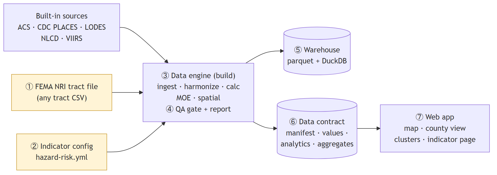{#fig-walkthrough-arch width=100%}

**Step 1: get the data.** The NRI publishes a composite risk score for every census tract, built from
expected annual losses across eighteen natural hazards together with social vulnerability and community
resilience. FEMA serves it through a public ArcGIS feature service; the script below downloads the North
and South Carolina tracts (v1.20, December 2025) into `data/local/`. Any table with an 11-digit tract
GEOID and a value column would work the same way.



**Step 2: describe it.** One YAML file tells the platform what the file contains: which column holds the
GEOID and which the value, the data year and tract vintage, the kind of measure, and how to credit the
source. The score has no margin of error, so `moe_col` is omitted; a file that has
one names it here and gets the same reliability flags as the ACS. Check the file's tract vintage before
setting `tract_vintage`: NRI v1.20 uses 2020 tracts, and the build stops with a hint if the GEOIDs do not
match the declared vintage.



**Step 3: build.** A single command ingests the file, keeps the region's tracts, runs the QA gate, writes
the warehouse, computes z-scores and clusters, derives county and regional values, and merges the
result into the application's data contract.



**Step 4: check the QA report.** The gate's record for the new indicator: all 752 tracts present, no
missing values, status `pass`. The same file is regenerated on every build, and a failing check writes
it before the build stops.



**Step 5: query the warehouse.** The new rows sit in the same long-format table as every other
indicator, so any SQL client can read them. `moe` and `reliability` are empty because the source
publishes no margin of error.



**Step 6: inspect the contract.** The handoff added a manifest entry, which credits FEMA and records that
county values are derived from tracts, and a values file the application reads directly.



**Step 7: view it in the application.** No application code changed. The indicator appears in the
Environment theme with its own choropleth, indicator page, county view, and cluster map
(@fig-wt-map, @fig-wt-info, @fig-wt-county, @fig-wt-lisa).

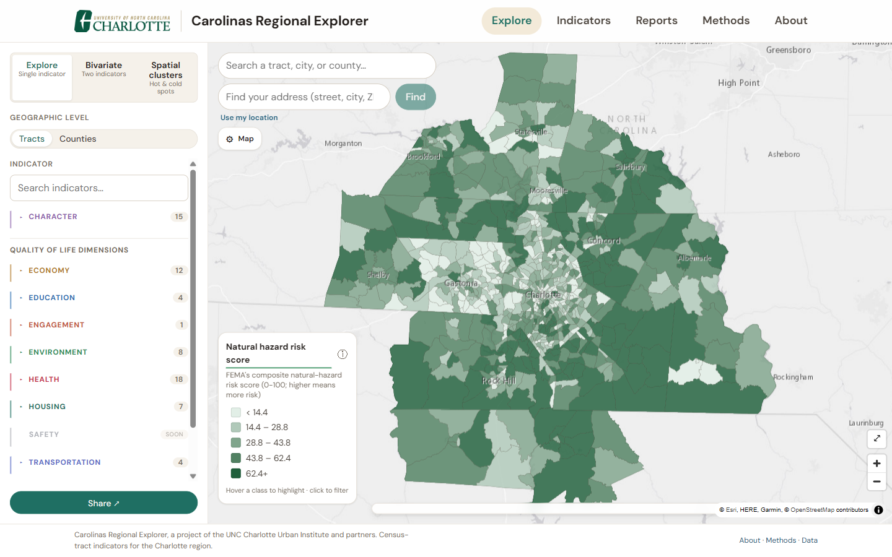{#fig-wt-map width=95%}

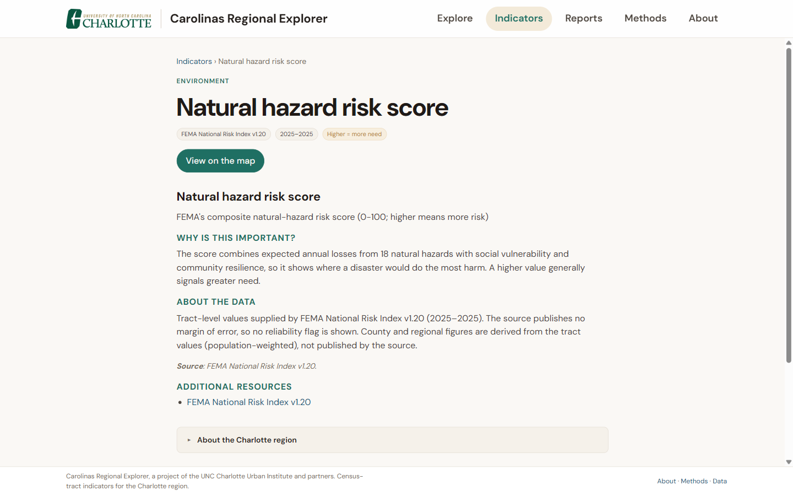{#fig-wt-info width=95%}

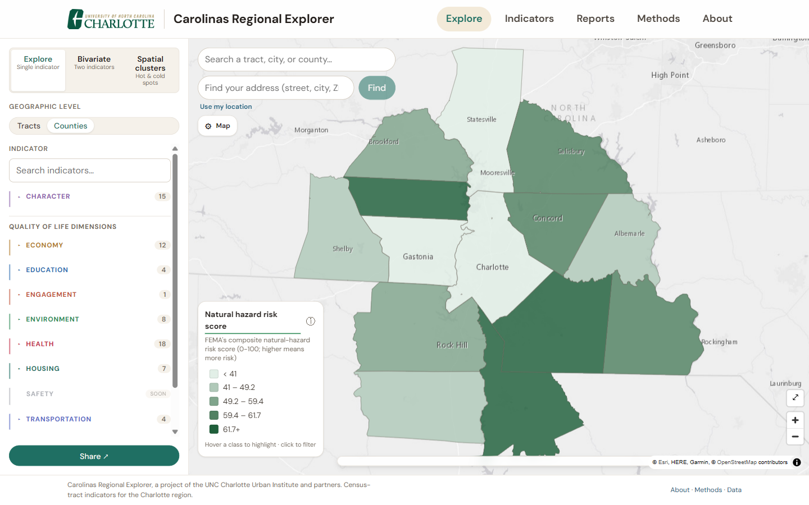{#fig-wt-county width=95%}

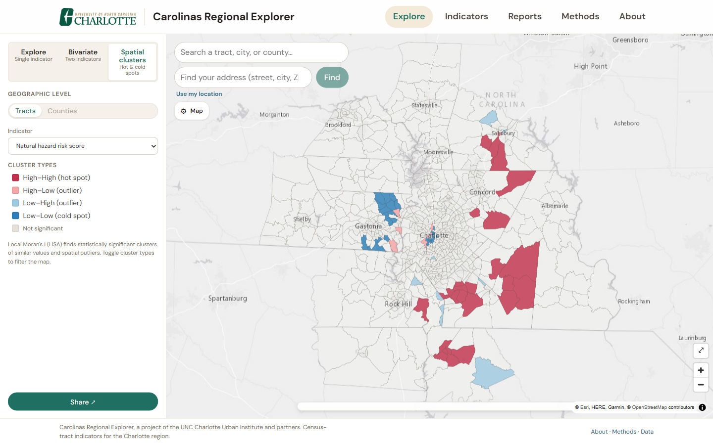{#fig-wt-lisa width=95%}

In all, the adopter supplied one CSV file and one YAML file. Quality checks, storage, spatial
statistics, county and regional values, metadata, and the map came from the platform.
